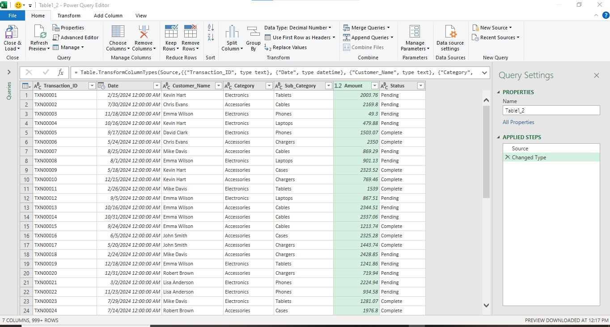
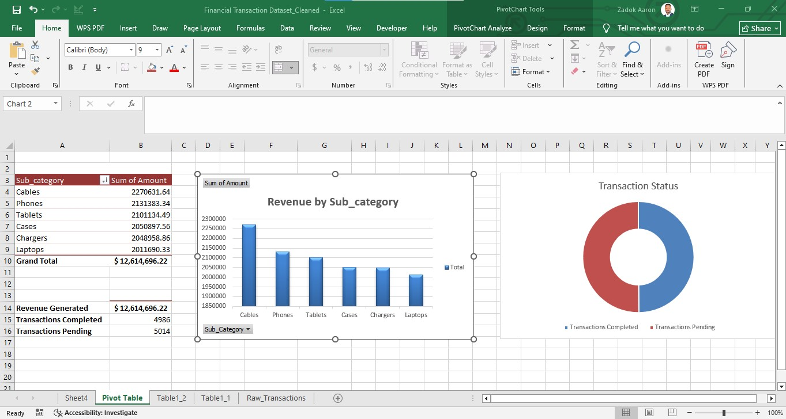
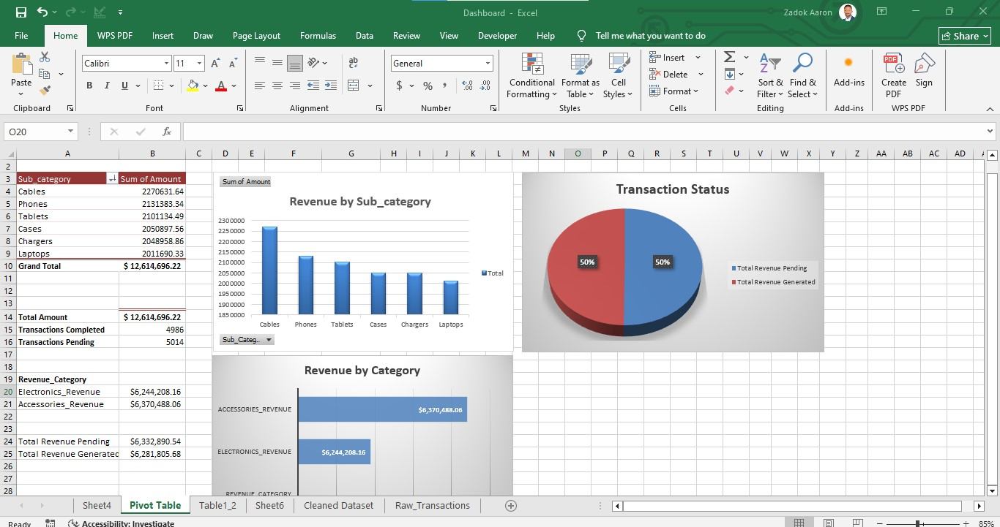

# Financial Transaction Data Analysis

Cleaning, transformation, and dashboard reporting of 10,500+ financial transaction records using Microsoft Excel (Power Query, Pivot Tables, and Dashboards).

## Project Overview

This project takes a raw, messy financial transactions dataset and turns it into a clean, structured dataset ready for reporting — then builds an interactive dashboard to surface revenue trends and transaction status across product categories.

**Tools used:** Excel (Power Query, Pivot Tables, Pivot Charts, Dashboards)

## The Data

- **Raw dataset:** `data/Financial_Transaction_Dataset_Raw.xlsx` — 10,513 transaction records with 6 fields (Transaction_ID, Date, Customer_Name, Product_Category, Amount, Status)
- **Cleaned dataset:** `data/Financial_Transaction_Dataset_Cleaned.xlsx` — same records after cleaning and transformation, split into structured fields ready for analysis

## Data Cleaning Process (Power Query)

The raw data had several quality issues that needed fixing before analysis:

| Issue | Fix |
|---|---|
| Combined category field (e.g. `Electronics_Tablets`) | Split into separate `Category` and `Sub_Category` columns |
| Inconsistent text casing (`CHRIS EVANS`, `chris evans`) | Standardized customer names to proper case |
| Inconsistent status values (`Pending`, `pending`) | Standardized `Status` field to consistent casing |
| Date stored as text | Converted to proper `Date` (datetime) type |
| Amount stored as text/mixed type | Converted to `Decimal Number` for accurate calculations |

*Power Query steps used to clean and reshape the raw transaction data.*

## Analysis: Pivot Tables

Built pivot tables to summarize revenue by sub-category and track transaction completion status.

**Key figures:**
- Total revenue tracked: **$12,614,696.22**
- Transactions completed: **4,986**
- Transactions pending: **5,014**
- Top revenue sub-category: **Cables** ($2,270,631.64)

## Dashboard

Combined the pivot tables and charts into a single dashboard view for at-a-glance reporting.

**Dashboard highlights:**
- **Revenue by Sub-category:** Cables led at $2.27M, followed by Phones ($2.13M) and Tablets ($2.10M); Laptops came in lowest at $2.01M
- **Revenue by Category:** Accessories generated $6.37M vs Electronics at $6.24M — a near-even split
- **Transaction Status:** Revenue is split almost 50/50 between completed ($6.28M) and pending ($6.33M) transactions, highlighting a meaningful share of revenue still awaiting completion

## Key Insights

1. Accessories slightly outperform Electronics in total revenue, despite Electronics typically carrying higher per-unit prices — suggesting higher transaction volume in Accessories.
2. Nearly half of all tracked revenue is still in **Pending** status, which could point to a bottleneck in transaction processing worth investigating further.
3. Cables is the single highest-revenue sub-category, making it a candidate for focused inventory/marketing attention.

## Skills Demonstrated

- Data cleaning and transformation with Power Query
- Data validation and standardization
- Pivot table design and summary reporting
- Dashboard design and data visualization
- Business insight generation from raw transactional data
